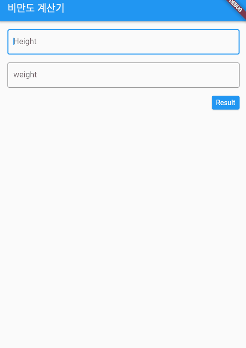

# flutter-toy-project

## sample

### bmi calculator

- 간단한 비만도 계산기 
- Flutter 화면 전환 
- 다른 페이지로 값 전달
- controller을 이용해 TextFormField의 값을 읽어오거나 valid 조건을 줄 수 있음 

### stop watch 

### login (design practise)